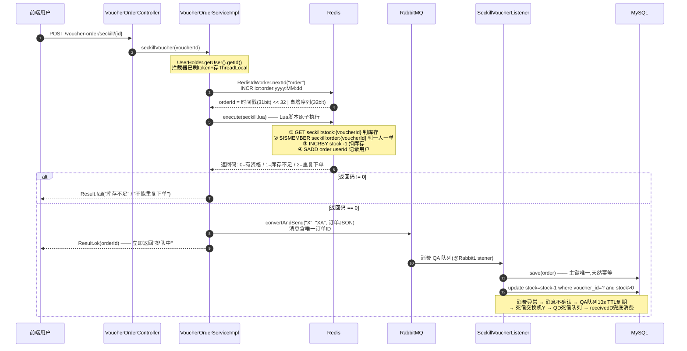

# 秒杀链路时序图(面试背诵版)

> 接口:`POST /voucher-order/seckill/{voucherId}`(`VoucherOrderController.java:26`)
> 核心代码:`VoucherOrderServiceImpl.java:204` + `seckill.lua` + `SeckillVoucherListener.java`

## Mermaid 时序图

(VS Code 装 Mermaid Preview / Typora / GitHub 均可渲染)

## 分步面试要点对照表

| 步 | 发生了什么 | 面试要点 / 可能追问 |
|---|---|---|
| 1 | 请求进 Controller | 路径、@RestController、无业务逻辑 |
| 2 | 从 ThreadLocal 取 userId | `UserHolder` 由 `RefreshTokenInterceptor` 写入;追问:为什么用 ThreadLocal、内存泄漏(记得 remove) |
| 3 | 生成全局唯一订单 ID | **雪花算法变种**:`RedisIdWorker`。31 位相对时间戳(2022-01-01 起算,可用 69 年)+ 32 位 Redis INCR 序列号(按天分 key,自动重置)。追问:和原版雪花比(去掉机器码,用 Redis 自增代替);时钟回拨问题不存在(时间戳只参与高位);趋势递增对 MySQL B+ 树索引友好 |
| 4 | **Redis + Lua 原子校验** | 核心中的核心。三个 key:库存 String(`seckill:stock:{id}`)、已购用户 Set(`seckill:order:{id}`)。Lua 保证"查库存→判重→扣库存→记用户"不可分割。追问:为什么不用分布式锁?——Lua 天然原子,少一次锁竞争;为什么库存不设 TTL?——数据强一致要求 |
| 5 | 返回码分流 | `0` 放行,`1` 库存不足,`2` 重复下单;秒杀资格判断**完全不碰 MySQL** |
| 6 | 发 MQ,同步变异步 | 资格通过=秒杀成功,DB 落库可以慢。追问:为什么必须用 MQ?——削峰 + 解耦 + 异步;发消息失败怎么办?——try/catch 抛异常(注意:此时 Redis 已扣库存,属对账兜底范畴) |
| 7 | 立即返回 orderId | 用户体验:不用等 DB。追问:前端拿 orderId 干嘛——支付、轮询订单状态 |
| 8 | 消费者落库 | **幂等**:订单 ID 是主键,重复消费第二次 `save` 直接失败,天然拦截。追问:RabbitMQ 是 At Least Once,重复投递不可避免 |
| 9 | DB 扣库存 | `where stock > 0` 乐观锁条件再兜底一次(Redis 已保证不超卖,这是双保险) |
| 10 | 死信兜底 | `QueueConfig`:QA 队列声明 `x-message-ttl=10s` + `x-dead-letter-exchange=Y`,消费异常进 QD 再处理一次。追问:死信队列应用场景(延迟队列、异常重试、人工介入) |

## 一句话背诵版

> 抢券请求 → ThreadLocal 拿用户 → Redis 生成雪花 ID → **Lua 一把过:查库存、查重、扣库存、记用户** → 通过就发 RabbitMQ、立刻返回"排队中" → 消费者异步落订单+扣 DB 库存(主键幂等) → 异常进死信队列兜底。

## 面试官爱挖的三个坑(提前想好答案)

1. **"Redis 扣了库存,但 MQ 消息丢了怎么办?"**
   答:不超卖/一人一单这两个秒杀核心要求由 Redis 已经保证,丢消息只影响 MySQL 库存展示和订单记录,属于最终一致性问题 → 秒杀结束后跑定时任务**对账**(比对 Redis 与 MySQL 的库存/订单),不一致则修复或人工介入。

2. **"为什么 DB 落库还要扣一次库存?"**
   答:Redis 是"预扣",DB 是"实扣"。两条独立通道(Redis 扣减 + MQ 异步落库),DB 的 `where stock>0` 是最后一道乐观锁防线,双保险。

3. **"seckill.lua 里为什么还有一行 `xadd stream.orders`?"**
   答:历史版本用 Redis Stream 做消息队列的残留,现方案 MQ 发送在 Java 层完成,该行不产生业务副作用。(主动承认演进史,反而加分)
